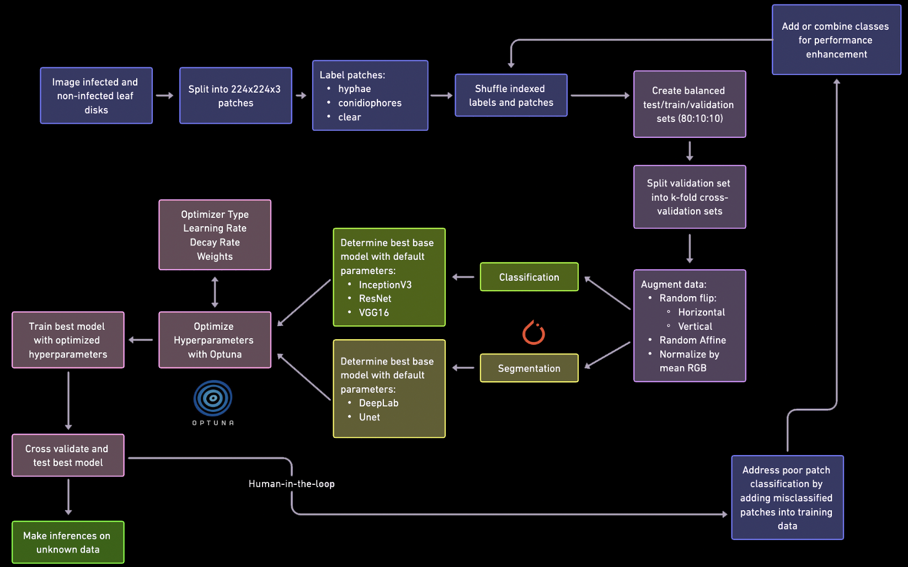
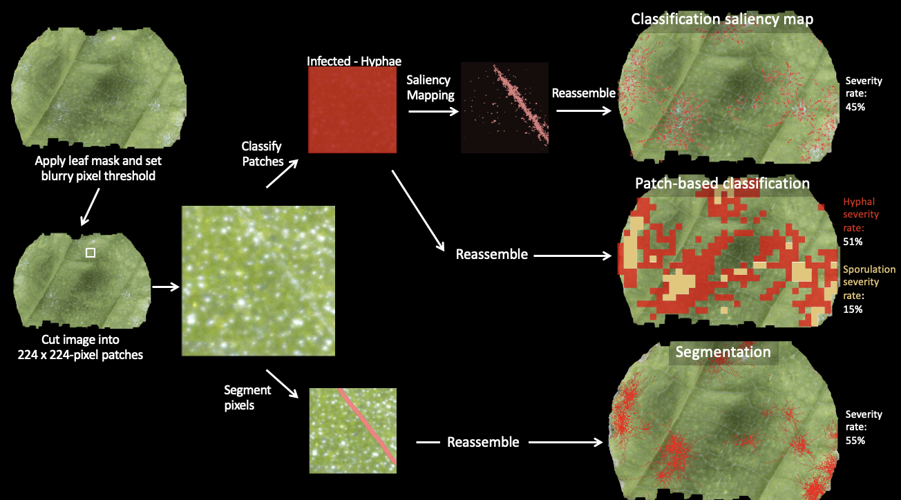
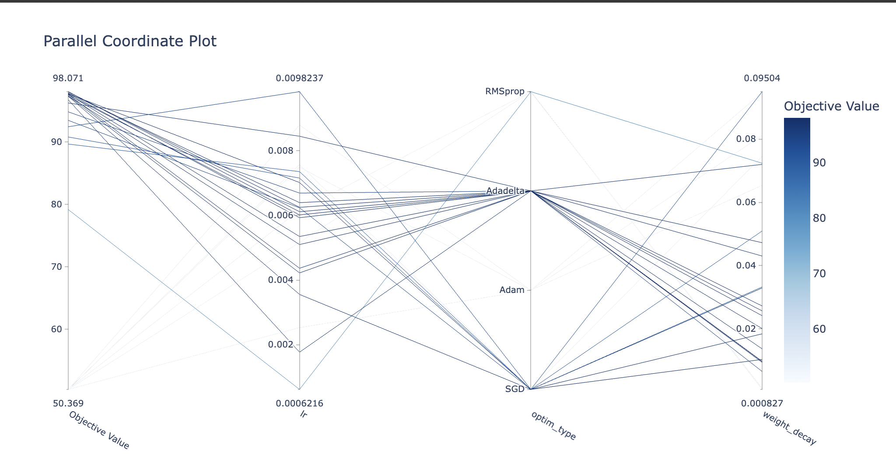
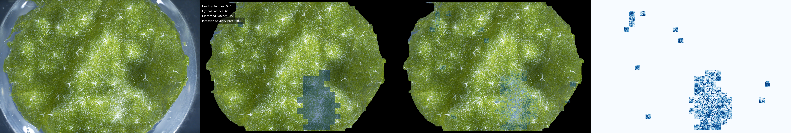

# Preface
The Blackbird is a highthroughput phenomics imaging platform developed through collaboration of scientists and engineers at [Cornell AgriTech](https://cals.cornell.edu/cornell-agritech), the [USDA-ARS Grape Genetics Research Unit (GGRU)](https://www.ars.usda.gov/northeast-area/geneva-ny/grape-genetics-research-unit-ggru/), and [Moblanc Robotics](https://moblancrobotics.com/). Most scripts in this repository build off of [Tian Qiu's Grape PM Saliency mapping repository](https://github.com/suptimq/Saliency_based_Grape_PM_Quantification) (used for [this paper](https://academic.oup.com/hr/article/doi/10.1093/hr/uhac187/6675613)). 

This repo is still in progress as I'm still actively improving our code and models; alas, feel free to email me with any questions or clarifications: [wisemami@oregonstate.edu](mailto:wisemami@oregonstate.edu) 

# Introduction

The code in this repository primarily uses [Pytorch](https://pytorch.org/get-started/locally/) pretrained models to train and subsequently make inferences on leaf disks with or without powdery mildew.  

Overview of the training and inference process:  

# Implementation

[CUDA](https://developer.nvidia.com/cuda-toolkit) is required for GPU usage; currently it's only available for PCs. Please check your GPU to figure out which version you need. If running on Apple Silicon, [MPS](https://developer.apple.com/metal/pytorch/) is necessary to take advantage of accelerated Pytorch.  

**Package Requirements**:  
To install the required packages via conda, simply run `conda env create -f environment.yml` and then `conda activate mildewVision` to activate the environment.     If running on **Google Colab**, check out a GPU (preferably A100 or better when training) and run: `!pip install optuna==3.1.0 termcolor` as the other packages should already be installed (as of 11/25/2025).  

## Classification Training
To train your own model, you need: 

1. A labeled image patch dataset to build the necessary train/test/val .hdf5 files
   - you can make image patches using [preprocessing/makePatches.py](preprocessing/make_patches.py). It's easiest to sort these patches into different directories according to the label (e.g. if infected, put in the "infected" directory. If not infected, put in the "healthy" directory)
   - In subsequent models, I would make patches by using the `--save_infected`, `--save_healthy` or `--save_discarded` tags when running [plot_leaf_sal.py](plot_leaf_sal.py), this way I could correct and add previously missclassified patches to my new dataset in hopes the next model iteration would learn the features better. 
   - you can then make a train/test/val hdf5 files (or k-fold splits) using [preprocessing/images_to_test_train_hdf5.py](preprocessing/images_to_test_train_hdf5.py)

2. To determine mean rgb chanel values for your test/train/val sets using [preprocessing/get_mean_std.py](preprocessing/get_mean_std.py) and plug those into your [scripts/train.sh](scripts/train.sh) script under `--means` and `--stds` (super important...this dramatically effects your model performance). 

3. Customize other training parameters such as the model, learning rate, etc. within the [scripts/train.sh](scripts/train.sh) script. See the argparse section in [classification/run.py](classification/run.py) to see full list of customizable variables.    Note: You can start with the default values, but your model will likely perform better if you try different base models and hyperparamter values (e.g. by using [Optuna](https://optuna.org/) hyperparameter optimization as shown below). Always cross-validate and test to ensure you're not overfitting though. 

## Inference
For classification inference, you can customize the argparse arguments in the [leaf_correleation_all.sh](./scripts/plot_leaf_correlation_all.sh) bash script to run inference on multiple datasets in parallel (adjust the `MAX_JOBS` parameter according to your computational power).  In the example [here](./scripts/plot_leaf_correlation_all.sh), I have included commands for calling either [plot_leaf_sal_map.py](plot_sal_map_leaf.py) or  [leaf_correlation.py](leaf_correlation.py). Both scripts return the same .csv file that provides metadata about your run parameters, disease severity estimates, saliency metrics, etc., but [plot_leaf_sal_map.py](plot_sal_map_leaf.py) also returns visual outputs of patch disease severity as well as saliency maps (if you include the optional saliency tags, see example below). If you are running standard inference you may opt to call the [leaf_correlation.py](leaf_correlation.py) [script](./scripts/plot_leaf_correlation_all.sh) instead as it runs 5-10x faster. 

 Example raw and deeplift saliency map (`--sal_deeplift`) output of from plot_sal_map.py:

## Segmentation Training
*Coming soon...*

## Testing
*Coming soon...*

# Image data
1 cm leaf disks were excised using ethanol disinfested leather punches and subsequently arrayed adaxial side onto up on 1% water agar plates. Image acquisition was performed using the Blackbird CNC Imaging Robot (version 1 "Blackbird-Green", developed by Cornell University, USDA-ARS Grape Genetics Research Unit, and Moblanc Robotics).  The Blackbird is a G-code driven CNC that positions a Nikon Z 7II mirrorless camera equipped with a 2.5x zoom ultra-macro lens (Venus Optics Laowa 25mm) in the X/Y position and then the camera captures images in a z-stack every 200 µM in Z-height.  Blackbird datasheets can be prepared using the [generateBlackbirdDatasheet.py](blackbird_processing/generateBlackbirdDatasheet.py) script. The image stacking process is automated using the [stackPhotosParallel.py](blackbird_processing/stackPhotosParallel.py) Python script. [Helicon Focus software](https://www.heliconsoft.com/software-downloads/) (Helicon Software, version 8.1) was utilized to perform the focus stacking, with the parameters set to method B (depth map radius: 1, smoothing radius: 4, and sharpness: 2).   Example images can be viewed [here](https://app.box.com/folder/221778779975?s=cfuosvlzzldi53pbjocjmbnf2ymhrkwa). Models, images, and training data to be released with manuscript. 

