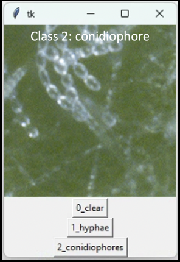

# Human vs Machine 

Use these scripts and files to reproduce human vs machine methods and results.  

**[1. human_vs_blackbird.xlsx](https://github.com/mswiseman/mildewVision/blob/main/humanvsmachine/human_%20vs_blackbird.xlsx)**  
Data file for our human and blackbird results with the patch data. 

**[2. human_tester.py](https://github.com/mswiseman/mildewVision/blob/main/humanvsmachine/human_tester.py)**  
Simple GUI that presents a random patch and allows the user to classify it as "clear", "hyphae", or "conidiophore". The program times the user and creates a .csv with the user response and time taken for each patch or image.  

**[3. human_visualizations.py](https://github.com/mswiseman/mildewVision/blob/main/humanvsmachine/human_visualizations.py)**  
Various graphs and visualizations with the human data.

**[4. random_image_fr_hdf5.py](https://github.com/mswiseman/mildewVision/blob/main/humanvsmachine/random_image_fr_hdf5.py)**  
Use this to create a random patch dataset. 

**[5. test_set](https://github.com/mswiseman/mildewVision/blob/main/humanvsmachine/test_set)**  
Directory of patches used to test experts and our best classification and segmentation models. 

**[6. practice](https://github.com/mswiseman/mildewVision/tree/main/humanvsmachine/practice)**  
Directory of patches used to familiarize the experts on the testing process.
